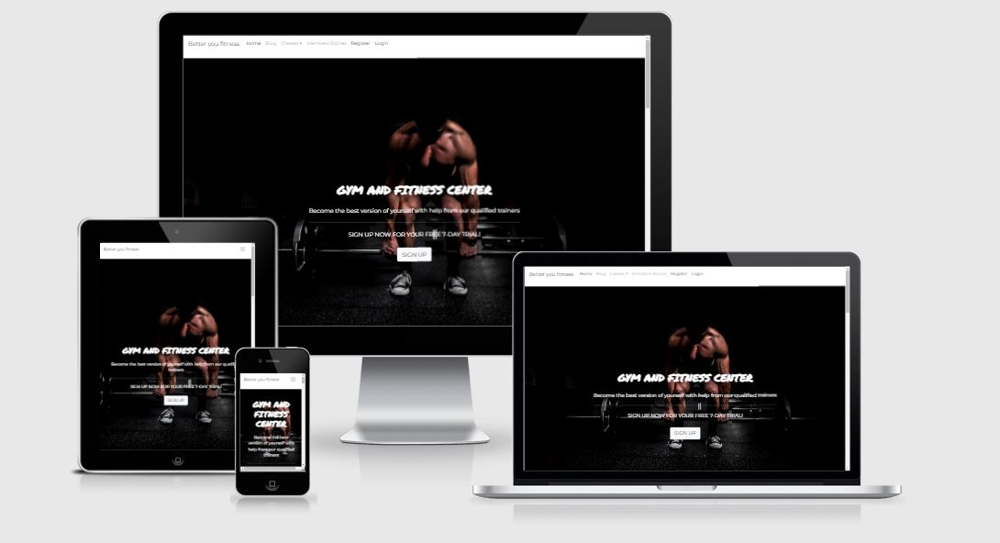
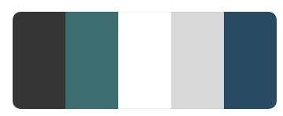

# Better you fitness

This project Better you fitness, is a webiste promoting a gym, and to get the user to sign in to a members only logon, browse classes and book an induction with one of the trainers.

## Showcase


A deployed version of my website can be found [here.] ()

## navigation

* [UX](#ux)
  + [UX-stories](#ux-stories)
  + [UX-Features](#ux-stories)
* [Strategy](#strategy)
  + [User-needs](#user-needs)
  + [Business-vision](#business-vision)
* [Scope](#scope)
* [Design](#design)
* [Structure](#structure)
* [Wireframes](#wireframes)
  + [Changes](#changes-to-wireframes)
* [Features](#features)
* [Technologies](#technologies)
* [Testing](#testing)
  + [Testing-plan](#testing-plan)
  + [Implementation](#implementation)
  + [Results](#results)
* [Bugs](#bugs)
* [Deployment](#deployment)
* [Credits](#credits)
* [Content](#content)
* [Media](#media)
* [Acknowledgements](#acknowledgements)

## UX

User stories
## First time visitor goals

* As a first time visitor, my aim is to feel engaged and drwn in by the big imagery.
* As a first time visitor, my aim is to be able to find what I am looking for very easily with an simple navigation through the site.
* As a First Time Visitor, I want to easily understand the main purpose of the site and learn more about the organisation.
* As a First Time Visitor, I want to be able to easily navigate throughout the site to find contact forms and to sign up for a free trial.
* As a First Time Visitor, I want to be able to easily navigate throughout the site to register a new account so I can comment on the blog posts.

## Returning visitor goals:

* As a returning visitor, my aim is for the site to be familiar and clear for the visitor to find what they were previously researching.
* As a returning visitor, I want my site to help reasure people they are in the correct place for the help or advice they need.
* As a Returning Visitor, I want visitors to find the best way to get in contact with the organisation with any questions they may have.
* As a Returning Visitor, I want visitors to feel reasurred if they feel nervous about contacting us to discuss thier weight concerns.
* As a returning visitor, I want to check if there has been any more blogs to rad and comments.


The end goal of the project is to help people to reach their weight and fitness goal with confidence .

### UX stories

* As a user I want to find help to improve my fitness.
* As a user I want to find help and advice to reach my weight loss goals.
* As a user I want to know what help or support is out there.
* As a user I want to find out what professional advice is available to me.
* As a user I want to find out some tips to keep to maintain my weight and fitness levels.
* As a user I would like to feel I am not alone and there is help for me.
* As a user I would like to be educated in various nutrtion benefits to help with my personal goals.
* As a user I would like to be register for my own account and to keep up with blogs posst.

# User Features
## Current Features
### **Navigation menu displayed across all pages**

The navigation menu will help the user move easily across all pages.

The navigation buttons update depending on whether a user is logged in or not, and whether that user is the admin:

| Nav Link              |Not logged in  |Logged in as user|Logged in as admin
|:-------------         |:------------- |:----------------|:------------- |
|Logo(back to home)     |&#9989;        |&#9989;          |&#9989;
|Sign Out               |&#10060;       |&#9989;          |&#9989;
|Register               |&#9989;        |&#10060;         |&#10060;
|Sign In                |&#9989;        |&#10060;         |&#10060;
|View Stories           |&#9989;        |&#9989;          |&#9989;
|Comment                |&#10060;        |&#9989;          |&#9989;
|View comments          |&#10060;        |&#9989;          |&#9989;
|Edit story             |&#10060;        |&#9989;          |&#9989;
|Delete story           |&#10060;        |&#9989;          |&#9989;
|Add story              |&#10060;        |&#9989;          |&#9989;

## Strategy

### User Needs

As a user the site has to be accessible on mobile, tablet and all browsers. Information should be clear to read, informative and helpful.
The site navigation needs to be optimal to move to the preferred section of the user.

### Business vision

The purpose of this project is to give users peace of mind that help and advice or just something to do socially, is out there. 
The site also gives the users easy access to personal trainers and view specific classes for their needs. Have a option to register for an account, with further login / log out functionality. 
The ability to read, like and leave a comment on recent blog posts.

## Scope

I want my users to feel they are not alone, that  there is help to get them to thier weight and fitness goal or a place to meet likeminded friends whilst getting fit. 

## Design
  ### Overall Feel

  For this site I wanted a very dark, cool feel that would emulate a workout experience. But this proved difficult in reading on smaller devices, especially in teh Nav bar, so I changed to a white background stricking images and dark buttons. 

  ### Colour Scheme

  While white is the main colour for the site and will be itilized as much as possible, I chose accent colours that I thought would not be overwhelming and add an elegance to it I didn;t choose to use all of teh colours on this swatch. 

  

  The colours are dark but not on readable areas so as to not overwhelm the user. 
  The dark grey will be used for the majority of the text and buttons.

  ### Typography
  I chose the [Montserra](https://fonts.google.com/specimen/Montserrat?query=Montserra) font for the text throughout the site. I like the simplicity of it an ease of reading. 

  I chose the [Permanent+Marker](https://fonts.google.com/specimen/Permanent+Marker?query=Permanent+Marker) font for headers. I thought it was an interesting font that added a little bit of flair to the site. 

### Imagery

The imagery throughout the site will be primarily dictated by researching on unspalsh and pexels.


## Structure

This project is a 9 page website. With a simple home page where the user can sign up for a free 7 day trial. A find us page whihc has a googles map, a meet the trainers page with a small intro to 3 trainers and a classes drop-down with 3 pages of Pilates, Spin and Circuits classes, plus a blog page to read, like and leave a comment on the blog. A register for an account page with a subsiquence login / log out function.

## Wireframes

The original wireframes can be found [here](https://res.cloudinary.com/dw11tbftk/image/upload/v1640098783/wireframe_ncayoh.jpg)

The Tablet wireframe can be found [here](https://res.cloudinary.com/dw11tbftk/image/upload/v1639407413/tablet_wireframe_cp5hhw.jpg)

The Mobile wireframe can be found [here](https://res.cloudinary.com/dw11tbftk/image/upload/v1639407411/mobile_wireframe_gg4lhu.jpg)

### Changes to wireframes

My site has changed considerably from the intitial wireframe, as I had my initial idea and as I started to build my page it took me in another direction, the more I descovered new methods.


## Features

This section contains some of the features this project contains:
* The homepage will be the landing page showing a large hero image to draw people in, an introduction to what the site is and a sign up button for a 7 day free trial.
* Scrolling down to a short paragraph, then an image carosel
* Scrolling down there are three sections with a short paragraoh on the benefits of Weigh lifting, Fitness in general and nutrition.
* Followed by a footer. 
* There are 8 additional pages a 'Find Us' page with a map and contact details
* A meet the trainers page with 3 sections and bio's of 3 personal trainers.
* A blogs page where the user (if regitered) can like, or leave a comment on each blog.
* A drop down menu of 3 addditional pages of classes, with a small description. Then some FAQ.
* A Register for an account page where the user will submit their personal details to open an account.
* Once registered, the user can then have the option to log in in future, or log out.


## Technologies

This project was build using the following technologies:

### Languages
* HTML5
* CSS3
* Javascript
* Python
* Django

### Libraries and online resources:
* Google Chrome Dev Tools: for testing purposes.
* My chosen fonts [Google Fonts}](https://fonts.google.com/).
* W3C HTML-validator: Used to find mistakes in my html code. [HTML-validator](https://validator.w3.org/nu/#textarea)
* FontAwesome: used for icons in the logo. [FontAwesome](https://fontawesome.com/)
* Coolors: to chose a color scheme. [Coolors](https://coolors.co/palettes/trending)
* Responsinator to check my website on all devices. [Responsinator](https://www.responsinator.com/).
* Responsive web design columns and grids to help with css columns media query [Responsive Web Design Grid](https://www.w3schools.com/css/css_rwd_intro.asp).
* README template from code institute fellow student [README.md template](https://github.com/ThijsTerporten/Climbing-Traveller/blob/master/README.md).
* Adobe Photoshop for editing my Photos
* Unsplash for the free images
* Adobe InDesign for my Wireframe
* Bootstrap Library
* Geek for Geeks for log in Django help
* EmailJS
* Cloudinary for image storage.
* Heroku

### Testing

## Testing Plan

Starting this project I know what my target audience would like to see on a website with fitness as its topic (I'm a fitness freak as well). I took into consideration on what devices my users would like to see the website on. For testing I designed the website mobile first, with extensive testing using Chrome DevTools for all Iphone's. Using DevTools I continued testing the website using settings for the Ipad and a 15.6 inch laptop screen. For large screens I used a 24 inch monitor. I wanted my page to be seen in a horizontal manner on larger screens a vertical manner for small screens, and on medium sized screens I am aiming to be in the middle of these two.

### Testing User Stories from User Experience (UX) Section

## First Time Visitor Goals

As a First Time Visitor, I want to easily understand the main purpose of the site and learn more about the organisation.

* Upon entering the site, users are automatically greeted with a clean and easily readable navigation bar to go to the page of their choice. Underneath there is a Hero Image with Text and a "Sign up for a free 7 day trial" Call to action button.
* The main points are made immediately with the navigation bar and call to action button.
* The user has three options, click the call to action buttons, scroll through the information and tips or click on the navigation bar to go directly to the place they need.
* As a First Time Visitor, I want to be able to easily be able to navigate throughout the site to find content.

* The site has been designed to be fluid and informative, easy to navigate. Each link describes what section the visitor will end up on.
* As a First Time Visitor, I want them to locate our social media links to see our following on social media to determine how trusted and known we are.

* Once the new visitor has read through the site, feel confident they can contact us using teh call to action modal on the home page.
* The user can also scroll to the bottom of any page on the site to locate the social media links in the footer.

## Returning Visitor Goals

* As a Returning Visitor, I want the visitor to find the where they were previously and feel confident to make the step to improve their fitness or weight loss goals.

* As a Returning Visitor, I want them to find the best way to get in contact with us with any questions they may have.

* The home page clearly highlights the "Sign up" Modal.

* Here they can fill out the form on the page or alternatively they can message the organisation on social media.
* The footer contains links to the organisations Facebook, Twitter and Instagram page.
* Whichever link they click, it will be open up in a new tab to ensure the user can easily get back to the website.
* As a Returning Visitor, I want them to find the Facebook Group link so that they can join and interact with others in the community.

* The Facebook Page can be found at the footer of every page and will open a new tab for the user and more information can be found on the Facebook page.

## Frequent User Goals

As a Frequent User, I want to check to see if there are any newly added help, advice or new trainers.

* The user would already be comfortable with the website layout and can easily click the call to action buttons or the navigation bar.
* As a Frequent User, I want them to check to see if there are any new infomation, tips, help or trainers.
* The user would already be comfortable with the website layout and can easily click the links to external sites.
* As a Frequent User, I want them to follow us on social media.

### Further Testing

* The Website was tested on Google Chrome, Internet Explorer, Microsoft Edge and Safari browsers.
* The website was viewed on a variety of devices such as Desktop, Laptop, iPhone7, iPhone 8 & iPhone X.
* A large amount of testing was done to ensure that all sections were linking correctly.
* Friends and family members were asked to review the site and documentation to point out any bugs and/or user experience issues.
* PEP8 code check for Python

### Implementation

Testing was mainly done using DevTools in google chrome. 
Starting mobile first then working my way up to bigger screen sizes. 
Whenever an element wasn't located where I wanted it to be I would use the `element.style` box in DevTools to find a solution. 

I used the WC3 code validators to check my code for mistakes as well. 

Testing is done in the following way: 

1. Scroll up and down the page checking for overflow and general positioning of items.
2. Use navigation bar to move to section of the page. 
3. In the form, try and click the button to check whether all fields are required to be filled in, check as well whether the e-mail part was set to e-mail.
4. Check all links in the footer whether they react as intended by opening in a new tab (for links section in footer). 
5. Run through all of these steps for each different screen size.
6. Use HTML and CSS validators from W3C schools to find mistakes in code.
7. Use PEP8 to validate my python code.
8. Use JShint to validate my JavaScript.
9. Use TestCase to test my Django
10. Jest to test my Javascript functions.


### Results

Once I had a general idea on how to run testing I followed all steps for each of my pages which gave me the following results:

* JS - Map [https://jshint.com/] - results []

* JS - Email Send [https://jshint.com/] - results []

* CSS-validator results: []

* PEP8 results: []

* HTML results: []


### Bugs

#### Django 

I wasn't very confident in my Django project, therfore having to delete it all and starting again, after lots of tutor help and my fellow coders on slack I managed to successfully install my project for a blog and log in log out funtion. Also following the, 'I think therefor I blog', walkthrough helped massively.

#### Intergrating Google Maps and Email JS into Django 

I had successfully install a Googele Map API into my project and an Sign up for a free trial email via EmailJS, however once I install my Django blog project none of my original functions worked, after some tutor advice and searching on slack and geek for geeks. I successfully managed to intergrate my API into Django project.


## Deployment

This project is deployed using gitpod in combination with github pages and Heroku.
I used gitpod to write all code and seeing it is linked with github it was easy to use the terminal to commit.

### Environment Variables
+ Click the 'Settings' tab towards the top of the page
+ Locate the 'Config Vars' and click 'Reveal Config Vars'
+ The following variables all need to be added:[here](media/configVars.JPG)

## The project was deployed to Heroku

1. Set DEBUG flag to FALSE in settings.py
2. Log in to Heroku and create a new app
3. In heroku remove the 'convig vars' DISABLE_COLLECTSTATIC
4. Go to deploy tab, scroll down to deploy branch.
5. Go to Heroku check the build is in progress and all is ok.

### Heroku Postgres Database
+ Go to the resources tab in Heroku.
+ In the Add-ons search bar look for Heroku Postgres & select it.
+ Choose the Hobby Dev-Free option in plans.
+ Click submit order form.
+ Go back to the build environment and install 2 more requirements:
  + ```pip3 install dj_databse_url```
  + ```pip3 install psycopg2-binary```


## Forking the GitHub Repository

By forking the GitHub Repository we make a copy of the original repository on our GitHub account to view and/or make changes without affecting the original repository by using the following steps...

1. Log in to GitHub and locate the GitHub Repository
2. At the top of the Repository (not top of page) just above the "Settings" Button on the menu, locate the "Fork" Button.
3. You should now have a copy of the original repository in your GitHub account.

## Making a Local Clone

1. Log in to GitHub and locate the GitHub Repository
2. Under the repository name, click "Clone or download".
3. To clone the repository using HTTPS, under "Clone with HTTPS", copy the link.
4. Open Git Bash
5. Change the current working directory to the location where you want the cloned directory to be made.
6. Type git clone, and then paste the URL you copied in Step 3.

$ git clone https://github.com/YOUR-USERNAME/YOUR-REPOSITORY

7. Press Enter. Your local clone will be created.

$ git clone https://github.com/YOUR-USERNAME/YOUR-REPOSITORY
> Cloning into `CI-Clone`...
> remote: Counting objects: 10, done.
> remote: Compressing objects: 100% (8/8), done.
> remove: Total 10 (delta 1), reused 10 (delta 1)
> Unpacking objects: 100% (10/10), done.


## Credits 

* Fontawesome for use from their icons. [Fontawesome](https://fontawesome.com/).
* Responsinator to check my website on all devices. [Responsinator](https://www.responsinator.com/).
* Responsive web design columns and grids to help with css columns media query [Responsive Web Design Grid](https://www.w3schools.com/css/css_rwd_intro.asp).
* README template from code institute fellow student [README.md template](https://github.com/ThijsTerporten/Climbing-Traveller/blob/master/README.md).
* Bootstrap for templates and components [https://getbootstrap.com/docs/5.1/getting-started/introduction/].

## Content

All content in this project are taken from researching the website.

## Media 

* All images where taken  [Pexels](https://www.pexels.com/nl-nl/).
* All video are from [YouTube](https://www.youtube.com/). 

## Acknowledgements 

I would like to acknowledge the tutor support available. They reassured me when I was doubtful of myself and my skills, and pointed me in teh direction of some useful information during our tutoring sessions about things they saw I was struggling with. Especially during the Django project and intergrating the API and email send into my Django project.

**This project was created for educational purposes only, credit for all images goes to their owners**

**Created by Mel Watts**
